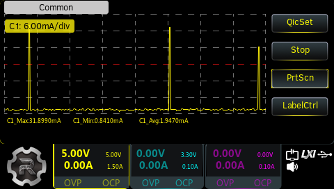

# ESP32 Weather Station

This project provides the software to run a smart weather station with a small color display based on the popular ESP32 microcontroller.

## Features

- Measurement of ambient temperature, relative humidity, barometric pressure
- Automatic time and date synchronisation over Wi-Fi
- Automatic light sleep
- Color display with three views:
  - Welcome page
  - Sensor dashboard with current readings
  - Sensor history over the last 24 hours

## Details

The weather station uses the following sensors to measure environmental factors:

1. [BME280](https://www.bosch-sensortec.com/products/environmental-sensors/humidity-sensors-bme280/): Combined ambient temperature, relative humidity and barometric pressure sensor connected via I²C
2. [BH1750](https://www.mouser.com/datasheet/2/348/bh1750fvi-e-186247.pdf?srsltid=AfmBOoqjl0lo1nhJkEdfEoB3mzjctO5_Caf2fZlqDm33lOlVTLgv2z1l): Digital ambient light sensor connected via I²C

The sensor readings are displayed on a 128x160 pixel TFT color display based on the [ST7735 controller](https://www.displayfuture.com/Display/datasheet/controller/ST7735.pdf) connected via SPI and uses DMA to update the screen without additional CPU load.

The screens are created using [LVGL v9.3](https://lvgl.io/) which can redraw subsets of the whole screen based on which widgets (temperature labels, animations etc.) need to be updated.

The Wi-Fi connection can be established by scanning the QR-code first displayed on the welcome screen of the display using the *ESP SoftAP Provisioning App* ([Android](https://play.google.com/store/apps/details?id=com.espressif.provsoftap), [iOS](https://apps.apple.com/us/app/esp-softap-provisioning/id1474040630)) and selecting the desired Wi-Fi network. The credentials are transmitted encrypted via a temporary access point created by the ESP32 and stored in the internal flash. Consequently, the QR-code will no longer be shown and the Wi-Fi connection will be re-established after each power cycle using the saved credentials.

Please keep in mind that this is a hobby project and neither is the flash currently encrypted nor are the provisioning credentials secret or unique per device.

The LCD backlight is automatically dimmed over a parametrized duration using gamma fading. The backlight is turned on again and updated once the user short-clicks the push button. While the backlight is not fully dimmed off the user can change between the currently displayed screens by another short click on the push-button. This also aborts the fading and returns the LCD back to 100 % brightness.

Holding the push-button for seven seconds or longer will perform a factory reset after which the Wi-Fi credentials are lost and the QR-code will be shown again.

## Configuration

- Pin mappings
- Usage of internal I²C and SPI hosts
- Refresh period of the sensors (default: once per minute)
- Server address for NTP time synchronisation
- Refresh period for NTP (default: 24 hours)
- Timezone including day-light-saving

## Roadmap

- [x] Implement averaging for correct 24 h history instead of 24 min
- [x] Read sensors using LP core
- [x] Sleep display and turn off backlight after n seconds of user inactivity
- [x] Wake display based on button
- [ ] Wake display based on proximity reading from time-of-flight sensor
- [ ] Deep sleep HP core
- [x] Re-evaluate power usage with Firebeetle
- [ ] Measure air quality and/or CO2 content
- [ ] Check feasibility of Matter integration, e.g. with Google Home to provide a warning based on humidity and temperature thresholds

## How to build the software

The software can be built and flashed using the [ESP-IDF extension](https://marketplace.visualstudio.com/items?itemName=espressif.esp-idf-extension) provided by Espressif.

The target hardware is the [FireBeetle 2 ESP32-C6](https://wiki.dfrobot.com/SKU_DFR1075_FireBeetle_2_Board_ESP32_C6) which is a low-power IoT board supporting Wi-Fi, Bluetooth, Zigbee and Thread. The board can be powered using a 3.7 V Li-Po battery via the JST-connector. Charging is taken care of by an onboard IC while additional battery protection (e.g. overcurrent while discharging, undervoltage) must be provided externally.

## How to connect the hardware

The GPIO pins of the **Firebeetle** are connected as follows:

GPIO-Pin-Number|Function
---|--------
1  | LCD Reset
2  | User Push-Button  
6  | I²C data when LP-core is enabled
7  | I²C clock when LP-core is enabled
16 | LCD Chip Select
18 | LCD Data/Command Select
19 | I²C data when LP-core is disabled
20 | I²C clock when LP-core is disabled
22 | LCD SPI Master-out-Slave-in
23 | LCD SPI Clock

A 4.7k pull-up resistor should be placed on the I²C pin as well as the LCD reset pin.

## Power consumption

Currently, the minimum power consumption is achieved when the LCD is faded off.
The ESP32-C6 is then in light sleep mode, the LCD controller is sleeping (blank display).
The low-power core wakes the high-power core every 60 seconds to update the sensor data.

Further possible optimizations include:

- Entering deep sleep once display is faded off
- Aggregate sensor values in LP-core to avoid wake-up
